# Лабораторная работа №1: Настройка среды разработки и первый HTTP-сервер

**Студент:** Рудик Аджамян  
**Группа:** ПИЖ-б-о-25-2(1)  
**Вариант:** 3  
**Технология:** Node.js + Express, Python + Flask

**Уровень:** Продвинутый


## Содержание

- [Цель работы](#цель-работы)
- [Теоретическое обоснование](#теоретическое-обоснование)
- [Выполнение практического примера](#выполнение-практического-примера)
- [Выполнение индивидуального задания](#выполнение-индивидуального-задания)
- [Контрольные вопросы](#контрольные-вопросы)
- [Вывод](#вывод)
- [Список использованных источников](#список-использованных-источников)

## Цель работы

Освоить установку инструментов для бэкенд-разработки, создать и запустить минимальный веб-сервер, обрабатывающий GET-запросы, понять концепцию эндпоинтов и научиться настраивать автоматический перезапуск сервера при изменениях кода.

## Теоретическое обоснование

Бэкенд — это серверная часть веб-приложения, которая принимает запросы от клиентов, выполняет необходимую обработку, взаимодействует с базами данных и формирует ответы. В клиент-серверной архитектуре клиентом может выступать браузер или мобильное приложение: он отправляет HTTP-запрос, после чего сервер обрабатывает его и возвращает HTTP-ответ.

Эндпоинт представляет собой конкретный адрес (URL) вместе с HTTP-методом, по которому клиент обращается к серверу. Маршрут связывает путь запроса с соответствующим обработчиком на сервере. В данной лабораторной работе используется метод GET, предназначенный для получения данных от сервера. Ответы API могут передаваться в формате JSON — текстовом формате обмена данными, широко применяемом в веб-разработке.

В качестве технологического стека выбран Node.js + Express. Node.js позволяет выполнять JavaScript на сервере, а Express упрощает создание серверных приложений, маршрутизацию и формирование HTTP-ответов. Для автоматического перезапуска сервера при изменении исходного кода используется nodemon.

## Выполнение практического примера

### 1. Создание проекта

Работа выполнялась в терминале Visual Studio Code.

Для инициализации проекта и установки необходимых зависимостей были выполнены команды:

```bash
npm init -y
npm install express
npm install --save-dev nodemon
```

После выполнения команд в проекте были созданы файл `package.json` и установлены зависимости Express и nodemon.

### 2. Создание сервера

В файле `app.js` был создан HTTP-сервер на основе Express.

```javascript
const express = require('express');

const app = express();
const port = 3000;

// Консольное логирование каждого запроса
app.use((req, res, next) => {
    console.log(`[${new Date().toISOString()}] ${req.method} ${req.url}`);
    next();
});

// Текстовый эндпоинт
app.get('/', (req, res) => {
    res.send('Добро пожаловать на базовый сервер!');
});

// JSON-эндпоинт 1
app.get('/api/status', (req, res) => {
    res.json({
        status: 'ok',
        uptime: process.uptime()
    });
});

// JSON-эндпоинт 2
app.get('/api/info', (req, res) => {
    res.json({
        author: 'Student',
        version: '1.0.0'
    });
});

// JSON-эндпоинт с параметром
app.get('/api/users/:id', (req, res) => {
    res.json({
        message: 'Информация о пользователе',
        userId: req.params.id
    });
});

// Обработка ошибки 404
app.use((req, res) => {
    res.status(404).json({
        error: 'Маршрут не найден'
    });
});

app.listen(port, () => {
    console.log(`Сервер запущен на http://localhost:${port}`);
});
```

### 3. Настройка автоматического перезапуска

В `package.json` был добавлен скрипт:

```json
"scripts": {
    "dev": "nodemon app.js"
}
```

Для запуска сервера используется команда:

```bash
npm run dev
```

После запуска сервер доступен по адресу `http://localhost:3000`.

**Скриншот 1 — запуск сервера командой `npm run dev`.**

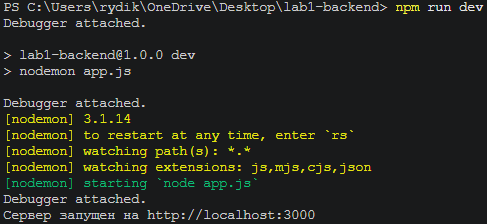

### 4. Проверка корневого маршрута

В браузере был открыт адрес:

```text
http://localhost:3000
```

Сервер вернул текстовый ответ:

```text
Добро пожаловать на базовый сервер!
```

**Скриншот 2 — результат выполнения GET-запроса к корневому маршруту `/`.**

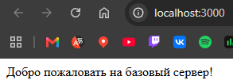

### 5. Проверка JSON-эндпоинта `/api/status`

Был выполнен запрос:

```text
http://localhost:3000/api/status
```

Сервер вернул JSON с текущим статусом и временем работы процесса.

**Скриншот 3 — результат запроса `/api/status`.**


### 6. Проверка JSON-эндпоинта `/api/info`

Был выполнен запрос:

```text
http://localhost:3000/api/info
```

Сервер вернул JSON с информацией об авторе и версии.

**Скриншот 4 — результат запроса `/api/info`.**


### 7. Проверка параметризованного эндпоинта

Был выполнен запрос:

```text
http://localhost:3000/api/users/5
```

Параметр `5` был передан серверу через часть URL и получен в обработчике с помощью `req.params.id`.

**Скриншот 5 — результат запроса `/api/users/5`.**

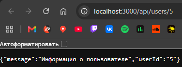

Дополнительно были проверены следующие адреса:

```text
http://localhost:3000/api/users/123
http://localhost:3000/api/users/ivan
```

**Скриншоты 6-7 — проверка параметризованного эндпоинта с другими значениями ID.**

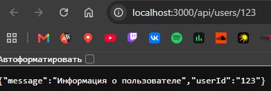

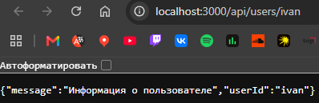

### 8. Проверка обработки ошибки 404

Для проверки обработки неизвестного маршрута был выполнен запрос:

```text
http://localhost:3000/anything-else
```

Сервер вернул HTTP-код `404` и JSON:

```json
{
    "error": "Маршрут не найден"
}
```

**Скриншот 7 — обработка неизвестного маршрута и ответ с кодом 404.**

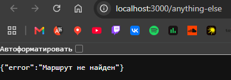

### 9. Проверка консольного логирования

При обращении к серверу в терминале отображаются HTTP-метод и URL каждого входящего запроса.

Пример:

```text
GET /
GET /api/status
GET /api/info
GET /api/users/5
GET /anything-else
```

**Скриншот 8 — консольное логирование входящих запросов.**

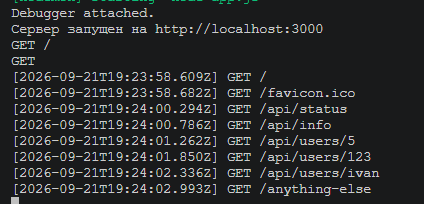

## 9. Выполнение практического примера — Python + Flask

### 1. Создание проекта

Создан проект и виртуальное окружение Python:

```bash
mkdir lab1-backend
cd lab1-backend
python -m venv venv
pip install flask
```


### 2. Создание сервера

Создан файл app.py со следующим кодом:

```Python
from flask import Flask, jsonify, request
import time

app = Flask(__name__)

@app.before_request
def log_request():
    print(f"[{time.strftime('%Y-%m-%d %H:%M:%S')}] {request.method} {request.path}")

@app.route('/')
def home():
    return 'Добро пожаловать на базовый сервер!'

@app.route('/api/status')
def status():
    return jsonify({"status": "ok", "framework": "Flask"})

@app.route('/api/info')
def info():
    return jsonify({"author": "Student", "version": "1.0.0"})

@app.route('/api/users/<int:user_id>')
def get_user(user_id):
    return jsonify({"message": "Информация о пользователе", "userId": user_id})

@app.errorhandler(404)
def not_found(error):
    return jsonify({"error": "Маршрут не найден"}), 404

if __name__ == '__main__':
    app.run(port=3000, debug=True)
```

### 3. Запуск и проверка сервера

Сервер запущен командой:
```
python app.py
```

**Скриншот 9 — Запуск Flask-сервера.**

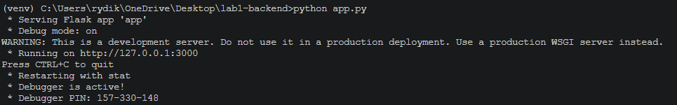

Проверены основные маршруты:

`/` — возвращает текстовое сообщение.  
`/api/status` — возвращает состояние сервера в JSON.  
`/api/info` — возвращает информацию о приложении.  
`/api/users/123` — возвращает данные пользователя по ID.  
`/test` — возвращает ошибку 404.  

**Скриншот 10 — Проверка маршрута.**

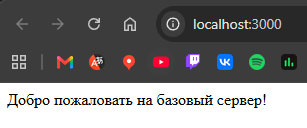

**Скриншот 11 — Проверка /api/status.**

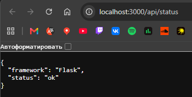

**Скриншот 12 — Проверка /api/info.**

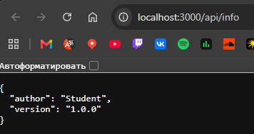

**Скриншот 13 — Проверка /api/users/123.**

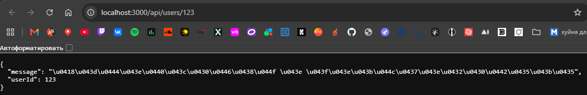

**Скриншот 14 — Проверка ошибки 404.**

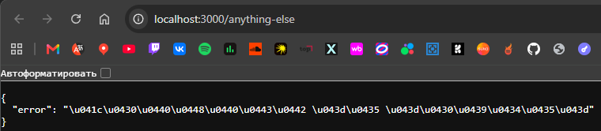

### 4. Проверка логирования

В консоли отображаются время, HTTP-метод и адрес каждого полученного запроса.

**Скриншот 15 — Логирование HTTP-запросов.**

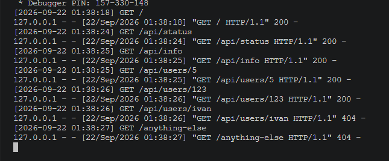

В результате был создан и запущен HTTP-сервер на Flask, реализованы необходимые маршруты, обработка ошибки 404 и автоматический перезапуск в режиме отладки.

## Выполнение индивидуального задания

**Вариант:** 3

**Уровень:** продвинутый

### Условие индивидуального задания

[Вставить условие и выбранные из таблицы эндпоинты своего варианта.]

### Код индивидуального задания

```javascript
// Вставить сюда фактически выполненный код индивидуального задания.
```

### Проверка эндпоинтов индивидуального задания

**Скриншот 9 — проверка первого эндпоинта индивидуального задания.**


**Скриншот 10 — проверка второго эндпоинта индивидуального задания.**


**Скриншот 11 — проверка третьего эндпоинта индивидуального задания.**


**Скриншот 12 — проверка параметризованного эндпоинта / обработчика 404, если они предусмотрены уровнем задания.**


## Контрольные вопросы

### 1. Что такое клиент-серверная архитектура?

Клиент-серверная архитектура — это модель взаимодействия, в которой клиент отправляет запрос серверу, а сервер принимает его, обрабатывает и возвращает ответ. Клиентом может быть браузер или мобильное приложение, а сервер выполняет серверную логику.

### 2. Какой протокол используется для общения клиента и сервера в вебе?

Для взаимодействия клиента и сервера в вебе используется протокол HTTP. Он определяет правила формирования и передачи запросов и ответов между клиентом и сервером.

### 3. Что такое эндпоинт (endpoint)?

Эндпоинт — это конкретный адрес URL в сочетании с HTTP-методом, по которому клиент обращается к серверу. Например, `GET /api/users` является эндпоинтом.

### 4. Какую структуру имеет HTTP-запрос и HTTP-ответ? Что такое код состояния?

HTTP-запрос содержит метод, URL, заголовки и, при необходимости, тело запроса. HTTP-ответ содержит код состояния, заголовки и, при необходимости, тело ответа. Код состояния показывает результат обработки запроса сервером. Например, `200` означает успешное выполнение запроса, а `404` — отсутствие запрошенного маршрута.

### 5. Что такое JSON? Почему он популярен в веб-разработке?

JSON (JavaScript Object Notation) — текстовый формат представления и обмена структурированными данными. Он популярен в веб-разработке благодаря простой структуре, удобству чтения и поддержке со стороны большинства современных языков программирования и веб-технологий.

### 6. Как запустить сервер на Node.js?

После установки зависимостей сервер можно запустить командой:

```bash
npm run dev
```

В данном случае команда запускает nodemon, который запускает файл `app.js` и автоматически перезапускает сервер после изменения кода.

### 7. Что такое автоматический перезапуск сервера и зачем он нужен?

Автоматический перезапуск позволяет серверу самостоятельно перезапускаться после изменения исходного кода. Это избавляет разработчика от необходимости каждый раз останавливать и запускать приложение вручную. Для Node.js в лабораторной работе используется пакет `nodemon`.

### 8. Какие коды состояния HTTP известны? За что отвечает код 404?

Коды состояния HTTP делятся на несколько групп: `1xx` — информационные, `2xx` — успешное выполнение, `3xx` — перенаправления, `4xx` — ошибки со стороны клиента, `5xx` — ошибки сервера. Код `404 Not Found` означает, что запрошенный ресурс или маршрут не найден.

### 9. Что такое middleware в Express?

Middleware — это функция Express, которая получает объект запроса, объект ответа и функцию `next`. Она может выполнять дополнительные действия до передачи управления следующему обработчику. В работе middleware используется, например, для консольного логирования входящих запросов.

### 10. Как получить параметр из URL-пути в Express?

Параметр указывается в маршруте через двоеточие, например:

```javascript
app.get('/api/users/:id', (req, res) => {
    console.log(req.params.id);
});
```

Значение параметра `id` извлекается из объекта `req.params`.

## Вывод

В ходе лабораторной работы была настроена среда разработки для создания бэкенд-приложения на Node.js с использованием Express. Был создан минимальный HTTP-сервер, настроены текстовый и JSON-эндпоинты, а также маршрут с параметром.

Была выполнена проверка созданных маршрутов через браузер, включая обработку неизвестного URL с возвратом ошибки `404`. Дополнительно было настроено консольное логирование входящих запросов и автоматический перезапуск сервера с помощью nodemon.

В результате работы были закреплены представления о клиент-серверной архитектуре, HTTP-запросах и ответах, маршрутизации, эндпоинтах, JSON и middleware Express.

## Список использованных источников

1. **Node.js — официальная документация:** https://nodejs.org/en/docs/
2. **Express — официальная документация:** https://expressjs.com/
3. **Flask — официальная документация:** https://flask.palletsprojects.com/
4. **MDN Web Docs — HTTP:** https://developer.mozilla.org/ru/docs/Web/HTTP
5. **MDN Web Docs — JSON:** https://developer.mozilla.org/ru/docs/Web/JavaScript/Reference/Global_Objects/JSON
6. **Nodemon — официальная документация:** https://nodemon.io/
7. **Postman — документация:** https://learning.postman.com/docs/getting-started/introduction/
8. **GeeksforGeeks — REST API в Express:** https://www.geeksforgeeks.org/node-js/explain-the-concept-of-restful-apis-in-express/
